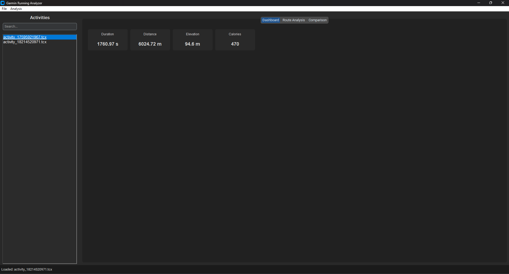

# **garminanalyzer**


---

## **Table of Contents**

- [Overview](#overview)
- [Features](#features)
- [Getting Started](#getting-started)
  - [Prerequisites](#prerequisites)
  - [Installation](#installation)
  - [Setting Up the Virtual Environment](#setting-up-the-virtual-environment)
- [Usage](#usage)
  - [Loading and Analyzing Activities](#loading-and-analyzing-activities)
  - [Route Visualization](#route-visualization)
- [GUI Overview](#gui-overview)
- [Project Structure](#project-structure)
- [Contributing](#contributing)
- [License](#license)
- [Contact](#contact)

---

## **Overview**

**garminanalyzer** is a Python-based GUI tool designed to parse, analyze, and visualize **Garmin `.tcx`** running activities. It incorporates:

- **Advanced Data Parsing** for laps, trackpoints (HR, power, cadence), etc.
- **SQLite Database** storage for quick references.
- **Plotly Dashboards** for heart rate, speed, and more.
- **Folium-based** route maps with pace-based color overlays.

Use it to gain deeper insights into training load, pace distributions, route performance, and advanced running metrics like VO2max estimates and custom interval detection.

---

## **Features**

- **Multi-Threaded Parsing**: Quickly load one or many `.tcx` files in the background.
- **Interactive Dashboards**: Real-time Plotly charts (HR, speed, power, distributions).
- **Folium Route Mapping**: Visualize each activity’s route with color-coded pace segments.
- **SQLite Storage**: Save essential activity metadata locally for easy future retrieval.
- **PDF Export**: Generate summary PDF reports for selected activities.
- **Comparison Tools**: Compare multiple activities’ duration, distance, or training load side by side.

---

## **Getting Started**

## Screenshot

Below is a preview of the GUI:



### **Prerequisites**

- **Python 3.8+** installed.
- **Git** (optional but recommended).
- **Visual Studio Code** (or similar IDE).

### **Installation**

1. **Clone the Repository**  
   ```bash
   git clone https://github.com/aliaslandemir/garminanalyzer.git
   cd garminanalyzer
